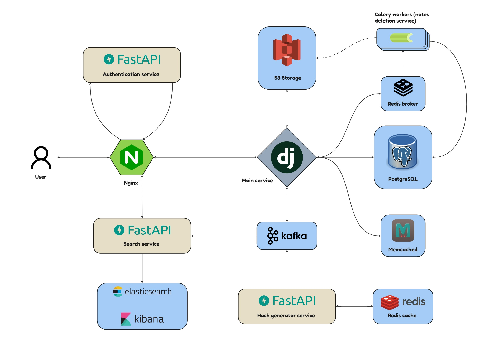

# Pastebin application
___
<a href="https://www.postman.com/pavellepesh/workspace/pastebin/collection/26749338-970d2184-c825-4347-a8fe-32fa70906536"></a>

## Description
___
This project is a web application designed for publishing text snippets. Snippets can have either private or public access. Additionally, there is an option to set the lifespan of your snippet.

## Application Architecture
___
Below is a graphical diagram of the application architecture:


### Application Components:
* **Main Service**: Written in Django/Django Rest Framework. It handles all operations with notes, comments and user stars.
* **[Search Service](https://github.com/Pavel-Lepesh/Pastebin-search-service)**: Written in FastAPI. Responsible for implementing record search. Built on interactions with ElasticSearch.
* **[Authentication Service](https://github.com/Pavel-Lepesh/Pastebin-authentication-service)**: Written in FastAPI. Used for user registration, authentication, and authorization through the issuance of JWT tokens. The main interaction occurs through automatic sub-requests to this service via Nginx when users make regular requests to the main application.
* **Nginx**: Acts as a request router and load balancer. Also responsible for interacting with the authentication service.
* **[Hash Generation Service](https://github.com/Pavel-Lepesh/Pastebin-hash-generator)**: Written in FastAPI. Used to generate hash links that will later be used in URLs to access user records.
* **Redis**: Used as a temporary storage for hash links for quick access from Kafka.
* **Kafka**: Kafka facilitates interactions between the main service and the search service by transmitting documents to the search service for subsequent indexing in ElasticSearch. Additionally, it handles the transmission of URL-like hashes from the hash generator to the main service. The docker-compose file includes a separate kafka-ui container that launches a client with a graphical interface for convenient visualization of interactions in Kafka.
* **ElasticSearch**: Documents are indexed in ElasticSearch to enable searching through them.
* **Kibana**: A visualization tool and graphical user interface for convenient interaction with ElasticSearch.
* **PostgreSQL**: The main database of the application.
* **Memcached**: A cache used to store popular user records.
* **S3 Storage**: The storage where all user records are saved.
* **Celery**: An asynchronous task queue used for deleting metadata of expired records. Optionally, it can also be used to delete records from S3 storage if the storage does not support automatic deletion of records after their expiration.

## Application Features
___
The application is developed based on a microservice architecture and is open to scaling. The [Hash Generator](https://github.com/Pavel-Lepesh/Pastebin-hash-generator) and [Authentication Service](https://github.com/Pavel-Lepesh/Pastebin-authentication-service) are universal applications that can also be used in other projects.

Users have access to operations for creating and managing their records, creating private links to records, and viewing popular public records of other users. There is an option to add favorite records to the "My stars" section. The system also includes comments and rating features for records and comments.

The API documentation is available [here](https://www.postman.com/pavellepesh/workspace/pastebin/collection/26749338-970d2184-c825-4347-a8fe-32fa70906536).

## Installation and Launch using Docker
___
1. Clone the repository and configure the .env files according to your setup:
    ```bash
    git clone https://github.com/Pavel-Lepesh/Pastebin-app.git
    ```
2. Start Docker and build the images (make changes to the docker-compose.yml file to match your setup):
    ```bash
    docker-compose -f docker-compose.yml build
    ```
3. Launch the containers with the following command:
    ```bash
    docker-compose -f docker-compose.yml up -d
    ```
4. Use the API commands available [here](https://www.postman.com/pavellepesh/workspace/pastebin/collection/26749338-970d2184-c825-4347-a8fe-32fa70906536). Set up the environment variables there before use.

## License
___
This project is distributed under the MIT License. See the [LICENSE](LICENSE) file for details.
