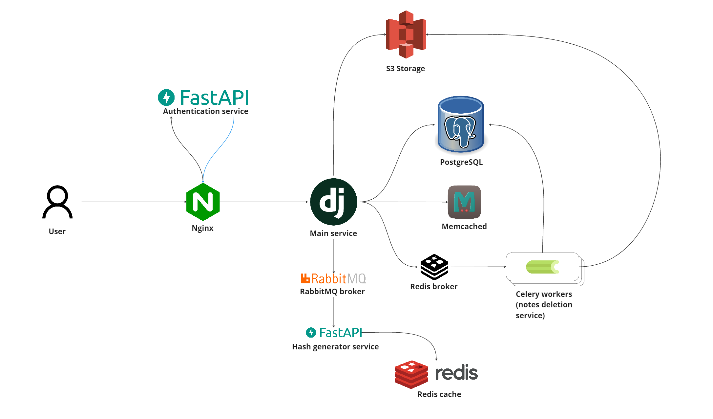

# Pastebin application
___
<a href="https://www.postman.com/pavellepesh/workspace/pastebin/collection/26749338-970d2184-c825-4347-a8fe-32fa70906536"></a>

## Описание 
___
Этот проект представляет собой веб-приложение, созданное для публикации текстовых фрагментов. Фрагменты могут иметь как приватный доступ, так и публичный. Дополнительно имеется возможность выбора времени жизни вашего фрагмента.

## Архитектура приложения
___
Ниже приведена графическая схема архитектуры приложения:


### Составляющие приложения:
* **Основной сервис**: Написан на Django/Django Rest Framework. Здесь происходит большая часть взаимодействий между сервисами.
* **Сервис аутентификации**: Написан на FastAPI. Используется для регистрации пользователей и их аутентификации и авторизации посредством выдачи JWT токенов. Основное взаимодействие происходит за счет автоматических подзапросов к этому сервису через nginx в момент обычных запросов пользователей к основному приложению.
* **Nginx**: Выполняет роль маршрутизатора запросов и распределителя нагрузки на сервис. Также отвечает за взаимодействие с сервисом аутентификации.
* **Сервис генерации хэшей**: Написан на FastAPI. Используется для получения хэш-ссылок, которые в дальнейшем будут использоваться в URL-адресах для доступа к записям пользователей.
  * **Redis**: Используется в качестве временного хранилища хэш-ссылок для быстрого доступа к ним из RabbitMQ.
  * **RabbitMQ**: Используется в качестве брокера сообщений для передачи хэш-ссылок из сервиса генерации хэшей в основной сервис.
* **PostgreSQL**: Основная база данных приложения.
* **Memcached**: Кэш, который используется для хранения популярных записей пользователей.
* **S3 Storage**: Хранилище, в котором сохраняются все записи пользователей.
* **Celery**: Асинхронная очередь задач, через которую происходит удаление мета-данных устаревших записей. Опционально, может использоваться также для удаления записей из S3 хранилища, если оно не поддерживает автоматическое удаление записей по истечении срока жизни фрагментов.

## Особенности работы приложения
___
Приложение разработано по принципу микросервисной архитектуры и свободно для масштабирования. [Генератор хешей](https://github.com/Pavel-Lepesh/Pastebin-hash-generator) и [Сервис аутентификации](https://github.com/Pavel-Lepesh/Pastebin-authentication-service) являются универсальными приложениями, которые также могут использоваться в других проектах.

Пользователям предоставляется доступ к операциям создания и управления своими записями, создания приватных ссылок на записи, а также для просмотра популярных публичных записей других пользователей. Есть возможность добавления понравившихся записей к себе в "My stars". Реализованы системы комментариев и рейтинга записей и комментариев.

Документация API приложения доступна [здесь](https://www.postman.com/pavellepesh/workspace/pastebin/collection/26749338-970d2184-c825-4347-a8fe-32fa70906536).

## Установка и запуск с помощью Docker
___
1. Клонируйте репозиторий и настройте файлы .env под вашу конфигурацию:
    ```bash
    git clone https://github.com/Pavel-Lepesh/Pastebin-app.git
    ```
2. Запустите Docker и соберите образы (внесите изменения в файл docker-compose.yml, учитывающие вашу конфигурацию):
    ```bash
    docker-compose -f docker-compose.yml build
    ```
3. Запустите контейнеры следующий командой:
    ```bash
    docker-compose -f docker-compose.yml up -d
    ```
4. Используйте API-команды, находящиеся  [здесь](https://www.postman.com/pavellepesh/workspace/pastebin/collection/26749338-970d2184-c825-4347-a8fe-32fa70906536). Перед использованием настройте переменные окружения там же.
## Лицензия
___
Этот проект распространяется под лицензией MIT. Подробности см. в файле [LICENSE](LICENSE).
